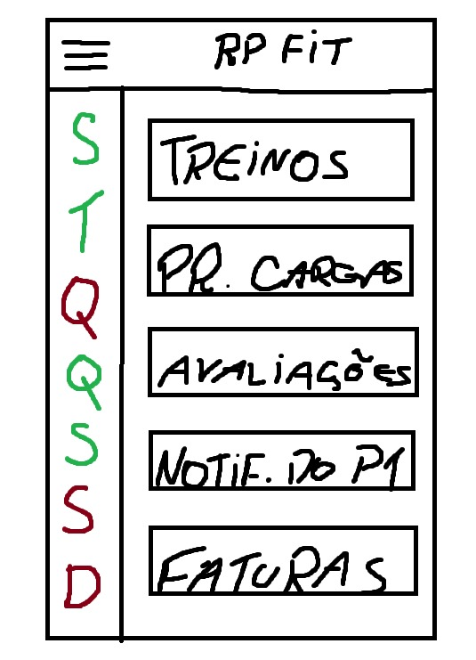
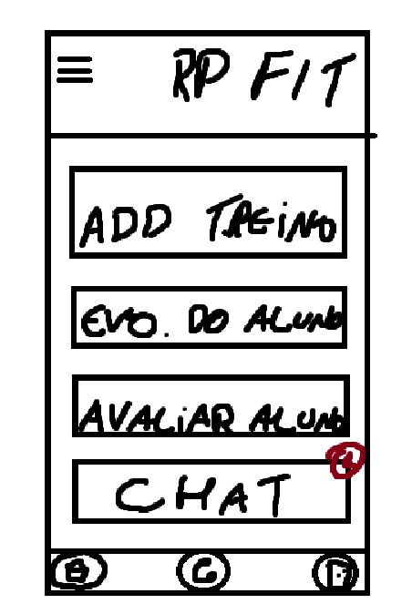
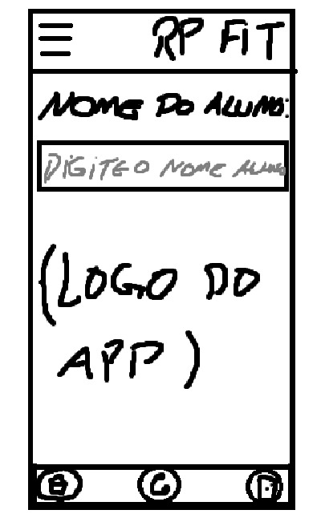

# **Tema escolhido:** Aplicativo de Gestão de Treinos para Academias

Trabalho de Experiencia do Usuário (UX) apresentado ao Centro Universitário [FEI](https://portal.fei.edu.br/), como parte dos requisitos necessários para aprovação na disciplina de Experiência do Usuário e Front-End (CCP310) do curso de Ciencia da Computação, orientado pelo Prof. Dr. [Fagner de Assis Moura Pimentel](https://github.com/fagnerpimentel).

## Componentes do Grupo

- Rafael Almeida Ferreira    RA: 24.224.013-3
- Renan Sartori Evangelista  RA: 24.224.004-2

## Resumo

Nosso aplicativo visa otimizar a gestão de treinos e a interação entre o aluno e o personal trainer. Ele oferece um sistema inovador onde o personal consegue montar treinos personalizados para cada tipo de aluno e acompanhar o progresso de cada um deles. O objetivo é melhorar a experiência do aluno, simplificando a rotina de treino.

## Introdução

- Atualmente, nas redes de academia, profissionais e alunos ainda enfrentam métodos antigos e muito utilizados, como o uso de planilhas ou papel para montar um simples treino, o que causa desorganização e falta de acompanhamento. Nosso aplicativo tem uma solução para esse problema, criando uma comunicação e um monitoramento em uma única plataforma.
- O objetivo do nosso aplicativo é criar uma conexão digital fluida e personalizada entre profissionais e alunos.
- A experiência do usuário deve ser intuitiva e fluida, permitindo que o personal trainer otimize seu tempo e o aluno se sinta confiante e motivado.
- Para o desenvolvimento deste projeto, foram selecionadas tecnologias modernas e eficientes, que garantem a escalabilidade, a performance e uma experiência de usuário de alta qualidade. As principais ferramentas utilizadas incluem:
    - HTML, CSS e JavaScript: A base fundamental do desenvolvimento web. O HTML será utilizado para a estruturação das páginas, o CSS para a estilização visual, e o JavaScript para a lógica e interatividade do aplicativo.
    - ReactJS: A aplicação será construída com ReactJS, um framework JavaScript que permite criar interfaces de usuário dinâmicas e reativas de forma eficiente, facilitando a construção de uma experiência fluida e moderna.
    - Figma: Para a etapa de design e prototipação, o Figma será a ferramenta principal, facilitando a criação de wireframes e protótipos interativos em média e alta fidelidade, além da colaboração em tempo real entre os membros do grupo.

## Publico Alvo ( Personas )

- Persona Primaria:
  - Nome: Renato Cariani (Personal Trainer)
  - Idade: 49 Anos
  - Profissão: Personal Trainer
  - Objetivo: Seu objetivo é otimizar a gestão de seus alunos e reduzir o tempo gasto com a criação de treinos, para que possa ajudar pessoas a alcançar resultados de forma mais eficiente.

  - Nome: Renan Sartori (Aluno)
  - Idade: 20 Anos
  - Profissão: Estudante Universitário
  - Objetivo: Ter uma rotina de treino organizada e acessível, com uma forma rápida de se comunicar com o personal trainer para tirar dúvidas e receber orientações.

- Persona Secundária:
  - Nome: Guilherme Thomazini (Sem Frequencia)
  - Idade: 46 Anos
  - Profissão: Médico
  - Objetivo: Encontrar uma forma de manter a saúde e o bem-estar físico mesmo com a rotina de trabalho exaustiva que impede a ida regular à academia. Ele precisa de um planejamento de exercícios que possa ser feito em casa, em poucos minutos e com o mínimo de equipamento.

### Mapa de empatia

- Determine o mapa de empatia[^1] de pelo menos uma persona primária e uma secundária.
- Renan Sartori (Persona Primária)
  - O que ele vê: Vê pessoas com corpos "perfeitos" nas redes sociais, vê academias cheias. Vê a ficha de treino de papel, muitas vezes bagunçada ou perdida.
  - O que ele ouve: Ouve conversas dos seus amigos progredindo cada vez mais na academia enquanto o personal dá pouca atenção.
  - O que ele diz e faz: Diz "Não sei se estou fazendo certo" e "Acho que não estou evoluindo". Ele se sente perdido, às vezes faz os exercícios de forma errada por falta de orientação.
  - O que ele pensa e sente: Pensa "Como vou me organizar com a faculdade e a academia?" e "Será que esse treino é para mim?". Sente ansiedade, insegurança e falta de motivação.
  - Dores: Não sabe se está executando os exercícios corretamente, sente-se desmotivado pela falta de progresso visível, tem dificuldades para se organizar, e a comunicação com o personal é limitada.
  - Ganhos: Ter a ficha de treino sempre acessível, poder tirar dúvidas rapidamente, receber motivação do personal pelo app, e ver o próprio progresso, o que o faz sentir-se mais confiante.
- Renato Cariani (Persona Primária)
  - O que ele vê: Vê alunos com dificuldade para seguir a ficha de treino, planilhas lotadas de informações, outros personais com a agenda cheia. Vê a falta de engajamento dos alunos fora da academia.
  - O que ele ouve: Ouve as reclamações dos alunos sobre a dificuldade de manter a rotina, sobre a falta de tempo. Ouve outros profissionais reclamando da burocracia do trabalho.
  - O que ele diz e faz: Diz "Se organize, que eu te ajudo!" e "O mais importante é a constância". Ele passa horas montando treinos, corrige a postura dos alunos, e tenta motivá-los individualmente.
  - O que ele pensa e sente: Pensa "Como posso gerenciar melhor todos os meus alunos de uma vez?" e "Preciso de mais tempo para focar no atendimento presencial". Sente frustração com a ineficiência do método tradicional e preocupação com a falta de resultados de alguns alunos.
  - Dores: Perda de tempo com tarefas administrativas, dificuldade em acompanhar o progresso de dezenas de alunos, comunicação limitada fora da academia.
  - Ganhos: Ter um sistema centralizado para gerenciar todos os alunos, economizar tempo na criação de treinos, conseguir acompanhar a evolução de cada aluno de forma visual e simples, e ter uma comunicação mais eficaz com eles.
- Guilherme Thomazini (Persona Secundária)
  - O que ele vê: Vê a rotina de trabalho exaustiva, com plantões e horários imprevisíveis.
  - O que ele ouve: Ouve o corpo pedindo descanso e sente as dores causadas pela má postura e falta de exercício.
  - O que ele diz e faz: Diz: "Não tenho tempo nem para almoçar direito, como vou para a academia?" e "Preciso de algo que se encaixe na minha rotina". Ele faz exercícios esporádicos quando tem um tempo livre (se tem), como alongamentos rápidos ou uma pequena caminhada.
  - O que ele pensa e sente: Pensa: "Minha saúde está em segundo plano por causa do trabalho" e "Será que existe alguma forma de me exercitar sem ter que ir para a academia?". Sente frustração por não conseguir cuidar de si mesmo.
  - Dores: Falta de tempo, não ter a possibilidade de ir a uma academia com regularidade.
  - Ganhos: Exercícios rápidos e eficientes que possam ser feitos em casa ou no intervalo do trabalho, sem a necessidade de equipamentos.

## Contexto de uso

- Descreva o ambiente em que o serviço ou poduto deve ser utilizado.
  - O aplicativo será utilizado principalmente em academias e centros de treinamento físico, onde o aluno está ativamente treinando e o personal está orientando. No entanto, o aplicativo também pode ser acessado em casa ou em qualquer lugar para consulta do treino, envio de mensagens ou análise do progresso.
- Qual/quais o(s) contexto(s) sociais, econômicos e culturais existentes neste ambiente?
  - Socialmente, o ambiente de academia promove a interação, mas o foco é individual. Economicamente, o aplicativo deve se encaixar no modelo de negócio da academia (assinatura, mensalidade). Culturalmente, o aumento da busca por saúde, bem-estar e o uso de tecnologia na vida diária são fatores importantes.
- Quais informações sobre o ambiente, o serviço ou poduto deve guardar antes de iniciar a interação?
   - O aplicativo pode se beneficiar de informações como a localização (para confirmar que o usuário está na academia), e futuramente, pode interagir com o ambiente (por exemplo, ao se conectar com equipamentos que fornecem dados sobre o treino).
- O que normalmente deve estar acontecendo com o ambiente quando o usuário interagir com o serviço ou poduto?
   - Quando o usuário interage com o app, o ambiente está barulhento, agitado e o aluno pode estar com as mãos suadas. O design da interface deve levar isso em conta, com botões grandes e de fácil acesso.

## Jornada do usuário
- Início: O aluno faz o cadastro no aplicativo e recebe o treino personalizado que foi montado pelo personal trainer.
- Desenvolvimento: O aluno segue o treino passo a passo diretamente pelo aplicativo. Para cada exercício, ele tem a opção de anotar as cargas e repetições realizadas. Se tiver qualquer dúvida sobre a execução, pode acessar um vídeo explicativo disponível em cada exercício.
- Final: Ao concluir a rotina de exercícios, o aplicativo exibe o tempo total de treino, além de registrar o progresso para acompanhamento futuro.

## Análise de concorrência

- Pesquise serviços ou podutos existentes atualmente que possam realizar o objetivo deste projeto.
- Selecione pelo menos 3 serviços ou podutos diferentes.
- Em relação aos concorrentes, respondam as seguintes perguntas?
  - Existe plataforma similar que atende o mesmo mercado e funcionalidades? Se sim: Quais os pontos positivos? Quais os pontos negativos?
  - Existe plataforma diferente quanto ao serviço, mas que atenda esse mercado? Se sim: Quais os pontos positivos? Quais os pontos negativos?

## Coleta de dados
  Formulário - Roteiro
  
  **Objetivo**: Compreender a rotina de treinos e a experiência com ferramentas de gestão para identificar pontos de melhoria e validar as funcionalidades do aplicativo.
  
  - Com que frequência você usa planilhas impressas ou de papel para seguir seu treino?
  
  - Com que frequência você sente que tem uma comunicação clara e regular com seu professor ou personal trainer fora da academia?
  
  - Com que frequência você registra os pesos e as repetições que faz durante o treino para acompanhar seu progresso?
  
  - Com que frequência você tem dúvidas sobre a execução correta de um exercício e precisa de ajuda visual (como vídeos ou fotos)?
  
  - Com que frequência você se sente motivado e confiante de que está no caminho certo para alcançar seus objetivos de treino?

  - Preencha o formulário clicando [Aqui](https://forms.gle/QxVrAAonHFweDEBw9)

  Entrevista - Roteiro
  
**Persona Primária - Personal Trainer** 
  
- Como você gerencia a rotina de treinos de seus alunos atualmente? Quais são os maiores desafios nesse processo?

- Qual a sua principal forma de comunicação com os alunos fora do ambiente da academia? Você sente que consegue acompanhar o progresso deles de forma eficaz?

- Quais funcionalidades em uma ferramenta digital seriam essenciais para otimizar seu tempo e melhorar a experiência dos seus alunos?

**Persona Primária - Aluno**

- Como você se sente em relação ao seu treino atual? Você sente que ele é personalizado e que realmente está te ajudando a alcançar seus objetivos?
  
- Quando você tem dúvidas sobre a execução de um exercício, o que você faz? Você se sente confiante para seguir o treino sozinho?
  
- O que faria você se sentir mais conectado e motivado com seu personal trainer e com seu próprio progresso na academia?

**Persona Secundária**

- Como você descreve sua rotina de trabalho e qual é o principal obstáculo que ela impõe ao seu bem-estar físico?

- Você já tentou fazer exercícios em casa? O que você busca em um treino que pode ser feito em poucos minutos e com o mínimo de equipamento?

- O que te ajudaria a manter a consistência e a motivação para se exercitar, mesmo nos dias mais cansativos?

## Análise Hierárquica de Tarefas
- 1.1. Acessar o Treino do Dia (Abas: Treinos)
    - 1.1.1. Acessar a aba "Treinos".
    - 1.1.2. Visualizar os blocos de treino (Hipertrofia, Abdomen, Emagrecimento, Mobilidade).
    - 1.1.3. Clicar em "Ver Treinos" para o bloco desejado.
    - 1.1.4. Iniciar o treino
    - 1.1.5. Visualizar o exercício específico (vídeo aula)

- 1.2. Registrar o Progresso (Abas: Pr. Cargas, Avaliações)
    - 1.2.1. Acessar a aba "Pr. Cargas".
    - 1.2.2. Inserir o peso e as repetições realizadas.
    - 1.2.3. Salvar o registro de carga.
    - 1.2.4. Acessar a aba "Avaliações".
    - 1.2.5. Visualizar o histórico de avaliações

- 1.3. Gerenciar o Status do Pagamento (Aba: Faturas)
    - 1.3.1. Acessar a aba "Faturas".
    - 1.3.2. Visualizar o status de pagamento.

- 1.4. Receber Notificações (Aba: Notificações)
    - 1.4.1. Acessar a aba "Notificações".
    - 1.4.2. Visualizar mensagens ou avisos da academia/personal.
    - 1.4.3. Receber notificações de pagamento.

## GOMS (Goals, Operators, Methods, Selection Rules)
- GOAL 0: Gerenciar a rotina de treino e acompanhar o progresso.
    - GOAL 1: Acessar e seguir um treino.
    - METHOD 1.A: Acessar um treino a partir da aba principal.
        (SEL. RULE: O usuário está na tela inicial, querendo começar o treino.)
        - OP. 1.A.1: Tocar na aba "Treinos".
        - OP. 1.A.2: Tocar no bloco do treino (Ex: "Hipertrofia").
        - OP. 1.A.3: Tocar no botão "Ver Treinos".
        - OP. 1.A.4: Ver a lista completa de exercícios do treino.
    - METHOD 1.B: Acessar um treino a partir de uma notificação.
        (SEL. RULE: O personal enviou uma notificação de "novo treino" e o usuário está com a tela do celular bloqueada ou em outro aplicativo.)
        - OP. 1.B.1: Tocar na notificação.
        - OP. 1.B.2: Verificar se o aplicativo abriu na tela correta.
        - OP. 1.B.3: Ver a lista completa de exercícios do treino.

- GOAL 2: Registrar o progresso de um exercício.
    - METHOD 2.A: Registrar após a conclusão de um exercício (durante o treino).
        (SEL. RULE: O usuário está na tela do exercício e acabou de executar.)
        - OP. 2.A.1: Ver os campos de entrada para peso e repetições.
        - OP. 2.A.2: Tocar no campo para mudar o peso.
        - OP. 2.A.3: Digitar o novo valor dos pesos.
        - OP. 2.A.4: Tocar no campo para mudar as repetições.
        - OP. 2.A.5: Digitar o novo valor das repetições.
        - OP. 2.A.6: Tocar no botão "Salvar".
        - OP. 2.A.7: Ver a confirmação que salvou o registro.
    - METHOD 2.B: Registrar após o treino (usando a aba "Pr. Cargas").
        (SEL. RULE: O usuário não registrou a carga durante o treino e quer fazer isso depois, ou está na tela principal e deseja registrar uma carga rapidamente.)
        - OP. 2.B.1: Tocar na aba "Pr. Cargas".
        - OP. 2.B.2: Preencher os campos de peso e repetições.
        - OP. 2.B.3: Tocar no botão para salvar.

- GOAL 3: Acompanhar o histórico de desempenho.
    - METHOD 3.A: Visualizar o histórico dentro da aba "Avaliações".
        (SEL. RULE: O usuário quer analisar sua evolução de forma geral.)
        - OP. 3.A.1: Tocar na aba "Avaliações".
        - OP. 3.A.2: Ver a visualização do histórico.
        - OP. 3.A.3: Examinar o gráfico de evolução de cargas/repetições.

- GOAL 4: Gerenciar informações de pagamento.
    - METHOD 4.A: Acessar a aba de Faturas.
        (SEL. RULE: O usuário quer verificar seu status de pagamento ou o próximo vencimento.)
        - OP. 4.A.1: Tocar na aba "Faturas".
        - OP. 4.A.2: Ler as informações de vencimento e status da fatura.

## Modelo de tarefas

## Design

- Pense nas características de Affordances do seu serviço ou poduto. 
    - Que tipo de acessibilidades devem ser consideradas dentro do seu projeto?
- Discuta o papel das expectativas do usuário no projeto deste serviço ou poduto. Qual a importância e pontos a serem considerados se você quiser vender esse serviço ou poduto?

### Prototipação em baixo nível (papel)
# Persona Primária - Aluno: Homepage

# Persona Primária - Aluno: Ver treinos

# Persona Primária - Personal: Homepage

# Persona Primária - Personal: Adicionar treino

#### Avaliação heurística

### Prtotipação em médio nível (Figma)
#### Avaliação heurística

### Prtotipação em alto nível (React)
#### Avaliação heurística

[^1]: Fonte: Adaptado de <https://hazeshift.com.br/mapa-de-empatia/>

<!-- TODOs:
- Add exemplos
 -->

